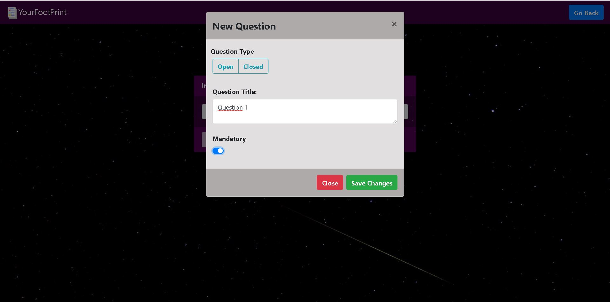
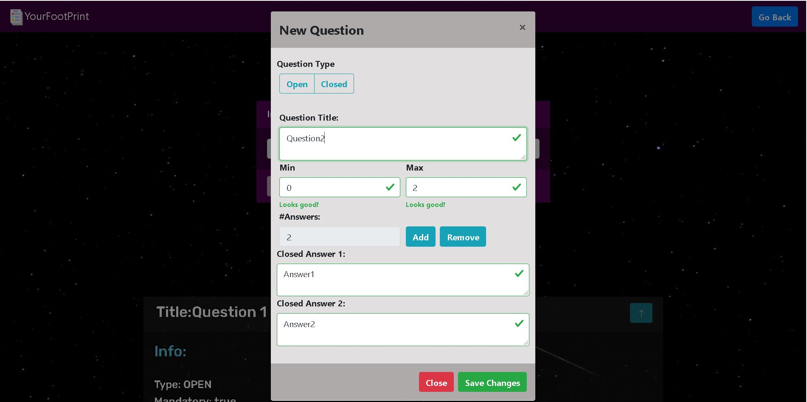
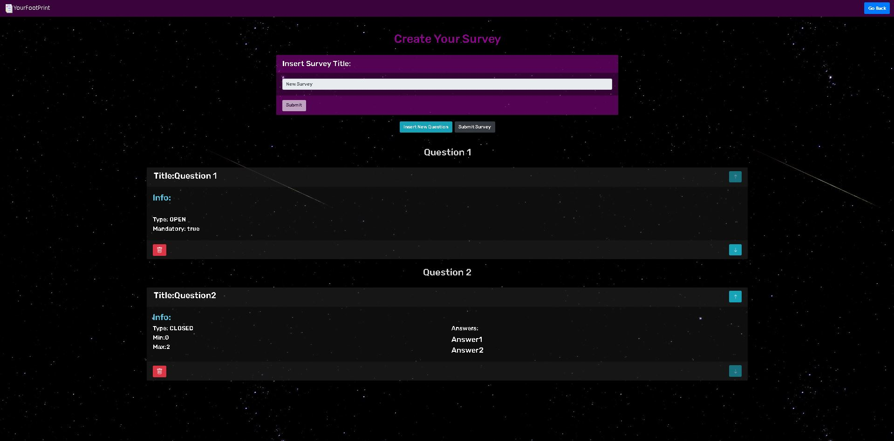

# Exam #1: "Survey"
## Student: s292672 FORMISANO MICHELE 

## React Client Application Routes

- Route `/`: Redirect To '/home' or To '/survey/:title' depending on a state variable which is 'survey'.

- Route `/home`: Home page with a center button to allow the navigation through other pages and log-in 
                  Button on the Nav.

- Route `/survey`: Page which displays all the surveys according to the role of the user (admin,common user).
                  1) User : Can navigate through the survey by clicking on it.
                  2) Admin : Can see the survey's number of responses and can navigate through one of them by clickin on it, he can logout.

- Route `/survey/:title`:  Page which displays the content of ONE survey according to the role of the user (admin,common user).
                           The param ':title' is the one selected by clicking one survey in the '/survey' page, it allows to 
                           display the content of the selected survey.
                           1) User : Can fill the chosen survey; once he insert his name the survey's content will appear, he can go back     to home through the navbar Brand logo if he doesnt want to fill the survey.
                           2) Admin : Can see all the responses of the survey fitlered by user, 1 user's survey compilation is displayed at time, he can switch through the responses by clicking the buttongroup in the bottom of the page. He can go back through the go back button or the navbar brand button.

- Route `/login` : Page which displays the form to be compiled in order to login.

- Route `/add` : Page accesible only by the admin. You can be redirect there by clicking the new survey button in the survey page.
                 The content is a Form to insert the title, then you are allowed to insert questions by a modal,after the saving of each question they will be displayed and it's possible to delete or modify the order. The submit button is active only after the question number is bigger than 0.

- Route `/404`: Page who is in charge to appear whenever the user/admin insert a wrong url. It is just a message with a cool meme and a     
                button which  redirects the user to the home  or the admin to the survey page.

## API Server

- POST `/api/sessions`
  - Description: Login request
  - Request query parameter: _None_
  - Request body: an object containing username and password 
  - Response: `200 OK` (success)
  - Response body : admin object.

- DELETE `/api/sessions/current`
  - Description: Logout request
  - Request query parameter: _None_
  - Request body:  _None_
  - Response: `200 OK` (success)
  - Response body :  _None_

- POST `/api/survey`
  - Description: submit the entire survey with question & closed answers 
  - Request query parameter: _None_
  - Request body: an object describing the survey containing its titleì and  array of object containing all the questions & closed answers (req.body.questions).
  - Response: `200 OK` (success)
  - Response body : lastId.

- POST `/api/user`
  - Description: adds the new user 
  - Request query parameter: _None_
  - Request body: a string containing the user name.
  - Response: `200 OK` (success)
  - Response body : lastId.

- POST `/api/question`
  - Description: creation of new question in a new survey 
  - Request query parameter: _None_
  - Request body: an object describing the question.
  - Response: `200 OK` (success)
  - response body : ("New question's id: " + lastId)

- POST `/api/question/:id`
  - Description: creation of new closed answer in a new survey 
  - Request query parameter: 'req.params.id'
  - Request body: an object describing the answer text.
  - Response: `200 OK` (success)
  - response body : ("New closed answer's id: " + lastId)

- POST `/api/user/question/:id`
  - Description: submission of new open answer by a user
  - Request query parameter: 'req.params.id'
  - Request body: an object describing the answer.
  - Response: `200 OK` (success)
  - response body : ("Added Relation between answer:" + lastId + "and UserId:" + uId)

- POST `/api/user/question/:id`
  - Description: creating the relation between user and answer (useful for both open and closed questions)
  - Request query parameter: _None_
  - Request body: an object describing uId and aId.
  - Response: `200 OK` (success)
  - response body : lastId;

- GET `/api/survey`
  - Description: Get the full list of surveys 
  - Request query parameter: _None_
  - Request body: _None_
  - Response: `200 OK` (success)
  - Response body: Array of objects, each describing one survey

- GET `/api/admin/survey`
  - Description: Get the full list of surveys  filtered by adminID
  - Request query parameter: req.user.id
  - Request body: _None_
  - Response: `200 OK` (success)
  - Response body: Array of objects, each describing one survey per admin

- GET `/api/user/:id`
  - Description: Get the user name given its id
  - Request query parameter: req.params.id
  - Request body: _None_
  - Response: `200 OK` (success)
  - Response body: user name 
  
- GET `/api/user/:id/:sId`
  - Description: Get user's answers related to a given survey
  - Request query parameter: 'req.params.id; req.params.sId;'
  - Request body: _None_
  - Response: `200 OK` (success)
  - Response body: Array of objects, each describing one answer 

- GET `/api/users/survey/:sId`
  - Description: Get all users who have filled a given surveys
  - Request query parameter: 'req.params.sId;'
  - Request body: _None_
  - Response: `200 OK` (success)
  - Response body: Array of objects, each describing one user  

- GET `/api/survey/:id/question`
  - Description: Get all question given the related survey
  - Request query parameter: 'req.params.id;'
  - Request body: _None_
  - Response: `200 OK` (success)
  - Response body: Array of objects, each describing one question 

- GET `/api/question/:id`
  - Description: Get all closed answer related to a closed question
  - Request query parameter: 'req.params.id;'
  - Request body: _None_
  - Response: `200 OK` (success)
  - Response body: Array of objects, each describing one answer 

- POST `/api/something`
  - request parameters and request body content
  - response body content
- ...

## Database Tables

- Table `administrator` - contains [ `id` | `username` | `hash` ]
- Table `answer` - contains   [ `id` | `text` | `qId` ]  (qId is questionId)
- Table `question` - contains   [ `id` | `title` | `sId` | `type` | `min` | `max` ] (sId is surveyId)
- Table `survey` - contains   [ `id` | `title` | `aId` ]   (aId is the adminId)
- Table `user` - contains   [ `id` | `name` ]
- Table `userAnswer` - contains   [ `uId` | `aId` | `id` ]  (relation between userId ans answerId)

## Main React Components

- `SurveyQuestions` (in `App.js`): 

  - 1) Admin: Checks his survey submissions.
  He can see the list of questions **QuestionList**
  A cycle which display each **Question** .
  For each question a cycle displays the **Answers**.
  He has the possibility to switch among the user's answers ( readOnly **Form**).

  - 2) User: Fills the Survey.
  He has to fill a **Form** with his name to begin the survey. 
  The **QuestionList** is displayed
  For each **Question** a **Form** is present: (text for open question, check for closed question).
  The **Answers** component is used to display the closed answer to be checked.

- `Surveys` (in `App.js`): 

  - 1) Admin: He sees the list of FILTERED surveys **SurveyList**. 
  The tile and the number of responses are displayed.
  The survey with no responses are deactivated.
  He can click on **Button** : "new survey","log Out".

  - 2) User: He can see the list of ALL surveys **SurveyList**
  For each of them a **NavLink** makes them browsable
  He can click on **Button** "Log In".

- `NewSurvey` (in `App.js`): 

  - Create a newSurvey. 
  - A **Form** has to be filled to begin. 

  - This unlocks the "insert new question" **Button**.
    It shows the **QuestionModal** component:
  2 buttons which activate 2 different forms : 

  - 1)**OpenQuestionForm** : creation of an open question
 Title **Form.Control** of type text ;
 Mandatory **Form.Control** of type switch;
  - 2)**ClosedQuestionForm**: creation of a closed question
 Title **Form.Control** of type text;
 2 **Form.Control** for 'min' and 'max' of type number;
 readOnly **Form.Control** for counting number of closed answers
 It is 'increased' and 'decreased' by 2 **Button**. 
 Saved the questions the admin can 
 'DELETE' or 'SWITCH' their position in the list.
(only _main_ components, minor ones may be skipped)

- `Home` (in `App.js`): 
  - Contains HomePage View with Login button and begin survey navigation button

- `Login` (in `App.js`): 
  - Contains Login Page with form for the admin

- `NotFound` (in `App.js`):
   - Contains the 404 error page

## Screenshot

## Users Credentials

| username | password |
|-------|----------|
| mario | password1 |
| luca | password2 |

### **Admin : mario**

|Survey|responses|
|------|--------|
|personal Info|2|
|Euro 2020|2|

### **Admin : luca**

|Survey|responses|
|------|--------|
|Culinary Taste|2|
|Nba Players|2|